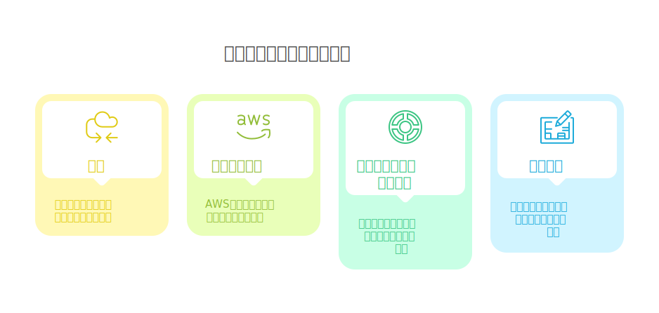
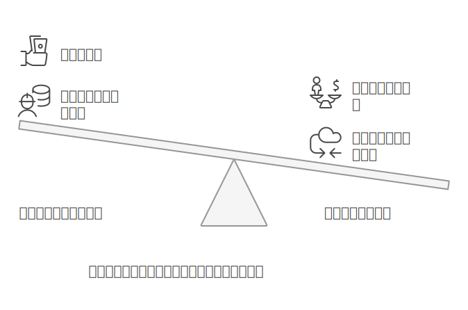
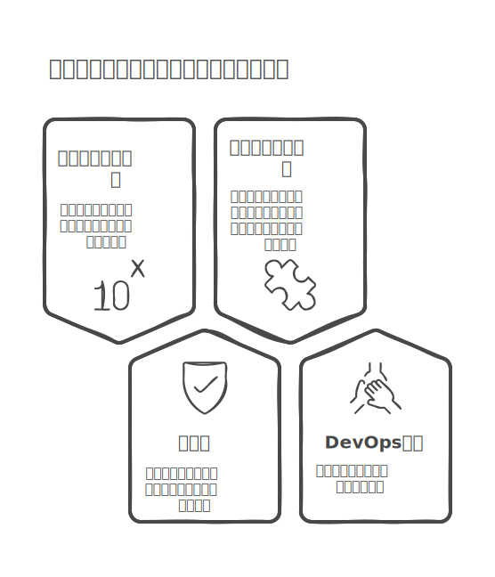
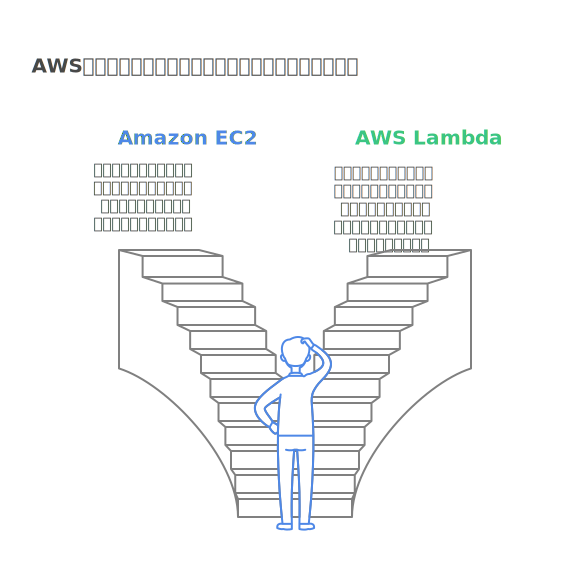
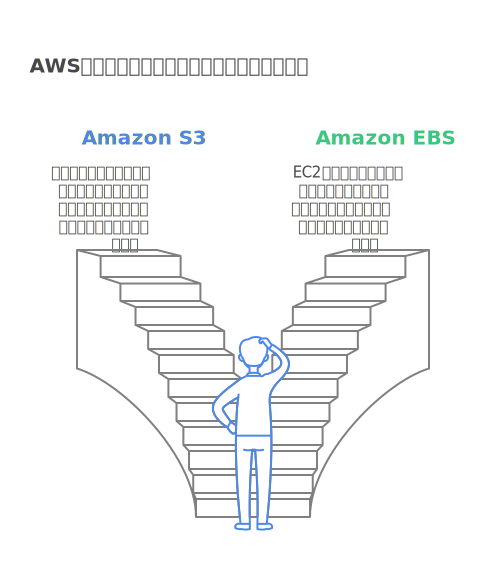
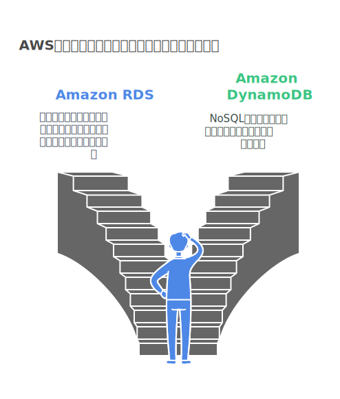
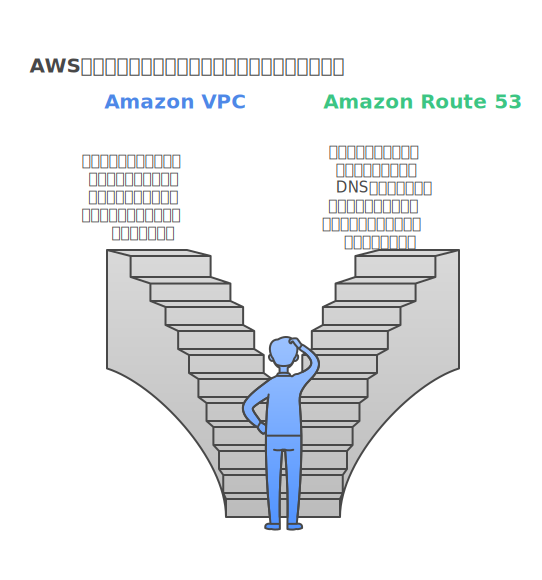
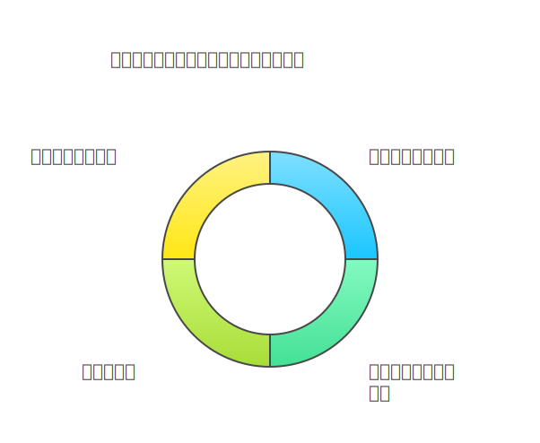
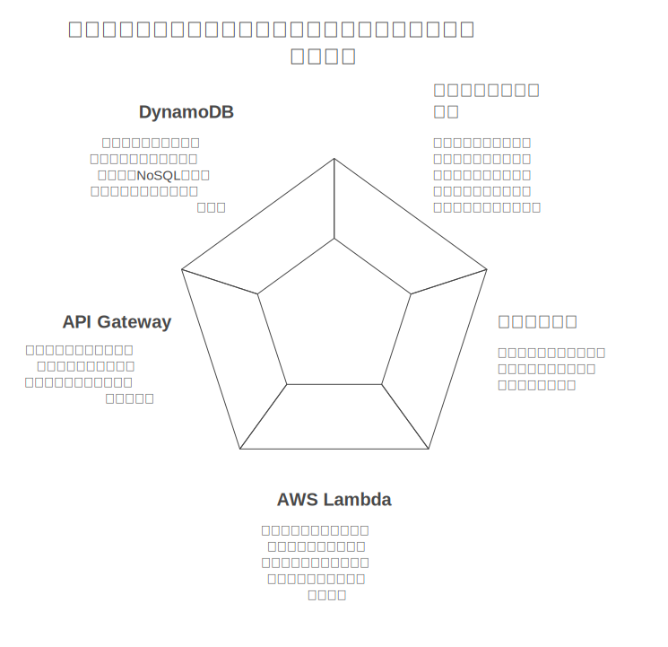
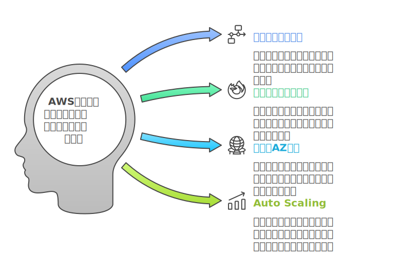

<!--
class: title
 -->

# クラウドネイティブの基礎と AWS のアーキテクチャパターン

---

## 1. はじめに

---

### 本日の目標

<!--
_class: slide-content
 -->

- クラウドネイティブの概念を理解する
- AWS の主要サービスの役割を把握する
- 基本的なアーキテクチャパターンを学ぶ
- アーキテクチャ図の作成方法を習得する

---

## 2. クラウドネイティブとは

---

### オンプレミスとクラウドの違い

<!--
_class: slide-content
 -->

- インフラ調達・運用の違い
  - オンプレミス：物理的なハードウェア管理が必要
  - クラウド：必要な時に必要なだけ利用可能
- コスト構造の違い
  - オンプレミス：初期投資が大きい
  - クラウド：従量課金制

---

### クラウドネイティブの特徴

<!--
_class: slide-content-image-left
 -->

- スケーラビリティ
  - 垂直スケーリング（スケールアップ/ダウン）
  - 水平スケーリング（スケールアウト/イン）
- 回復性
  - 自動復旧機能
  - 分散システム設計
- マイクロサービス
  - 独立したサービスの組み合わせ
  - 柔軟な開発・デプロイ
- DevOps 文化
  - 開発と運用の統合
  - 継続的なデリバリー

---

## 3. AWS の主要サービス

---

### コンピューティング

<!--
_class: slide-content-image-left
 -->

- Amazon EC2
  - 仮想サーバー
  - 多様なインスタンスタイプ
- AWS Lambda
  - サーバーレスコンピューティング
  - イベント駆動型の実行

---

### ストレージ

<!--
_class: slide-content-image-left
 -->

- Amazon S3
  - オブジェクトストレージ
  - 高い耐久性と可用性
- Amazon EBS
  - ブロックストレージ
  - EC2 インスタンス用

---

### データベース

<!--
_class: slide-content-image-left
 -->

- Amazon RDS
  - リレーショナルデータベース
  - 自動バックアップと保守
- Amazon DynamoDB
  - NoSQL データベース
  - 自動スケーリング

---

### ネットワーキング

<!--
_class: slide-content-image-left
 -->

- Amazon VPC
  - プライベートネットワーク空間
  - セキュリティ制御
- Amazon Route 53
  - DNS サービス
  - トラフィック制御

---

## 4. アーキテクチャパターン

---

### マイクロサービスアーキテクチャ

<!--
_class: slide-content-image-left
 -->

- 特徴
  - サービスごとの独立性
  - 個別のデプロイメント
- AWS での実現方法
  - ECS/EKS でのコンテナ化
  - API Gateway + Lambda の組み合わせ

---

### サーバーレスアーキテクチャ

<!--
_class: slide-content-image-left
 -->

- メリット
  - インフラ管理不要
  - コスト最適化
- 主要コンポーネント
  - AWS Lambda
  - API Gateway
  - DynamoDB

---

### 高可用性アーキテクチャ

<!--
_class: slide-content
 -->

- 設計原則
  - 単一障害点の排除
  - 自動復旧メカニズム
- AWS の機能活用
  - マルチ AZ 配置
  - Auto Scaling
  - Elastic Load Balancing

---

## 5. ハンズオン：アーキテクチャ図作成

---

### AWS Architecture Center の使い方

<!--
_class: slide-content
 -->

- 基本操作
  - アイコンの配置
  - コンポーネントの接続
  - レイヤー分け
- 説明の追加方法

---

### 実践演習：Web アプリケーションの設計

<!--
_class: slide-content
 -->

1. VPC 設計
   - パブリック/プライベートサブネット
   - アベイラビリティゾーン
2. コンピューティング層
   - EC2 インスタンス配置
   - Auto Scaling 設定
3. データベース層
   - RDS の冗長構成
   - バックアップ設定
4. セキュリティ設計
   - セキュリティグループ
   - NACL の設定

---

## 6. まとめ・質疑応答

---

### 本日のまとめ

- クラウドネイティブの利点
- AWS サービスの選択基準
- アーキテクチャ設計のポイント

---

### 次回への準備

- 興味のあるサービスのアーキテクチャを考えてくる
- AWS 無料アカウントの作成

---

### 参考資料

- AWS Well-Architected Framework
- AWS アーキテクチャセンター
- AWS 認定ソリューションアーキテクト学習教材
